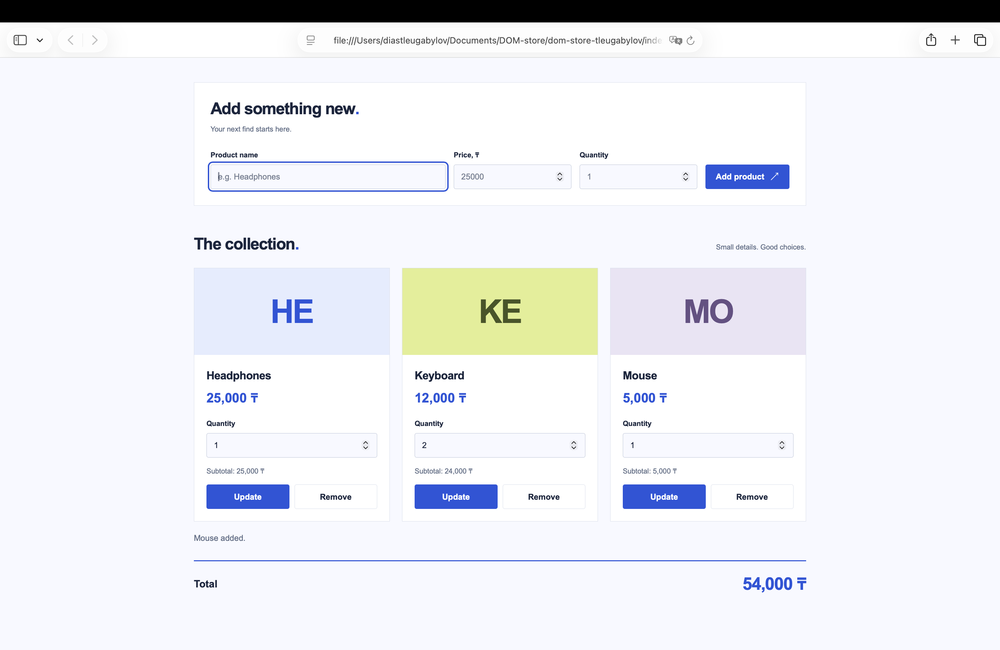

# DOM-Store
A simple product manager built with HTML, CSS, and vanilla JavaScript. It uses the Store class adapted from Lab 4.
## How to open
Download or clone this repository and open `index.html` in a modern browser. No installation or build step is required.
## Features

- Add products with a name, price, and quantity.
- Display products as cards.
- Show validation errors next to the relevant fields.
- Update quantities and remove products.
- Recalculate the total after every product change.

Prices must be greater than zero. Quantities must be non-negative whole numbers. Adding a product with an existing name increases its quantity and keeps its original price.
Products are stored in memory and reset when the page is reloaded.
## Events in my code
I use a delegated `click` listener on the container that holds the form and product cards. It finds the clicked button with `closest()` and reads `data-action` to choose add, remove, or update. This also works for cards created after the page loads, without adding listeners to each button. I handle the form's `submit` event to support keyboard submission and use `preventDefault()` to prevent a page reload. After a successful change, I render the cards again and update the total.
## Screenshot

## Live demo
[Open Store](https://tleugabylov-dias.github.io/dom-store-tleugabylov/)
## AI tools

I used ChatGPT/Codex for step-by-step guidance, code examples, styling, and explanations of DOM events and validation.